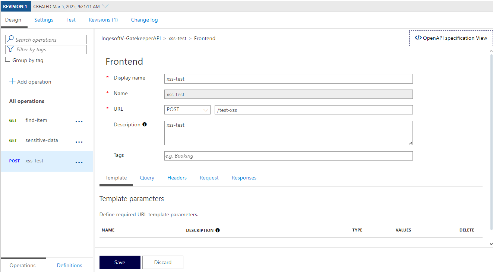
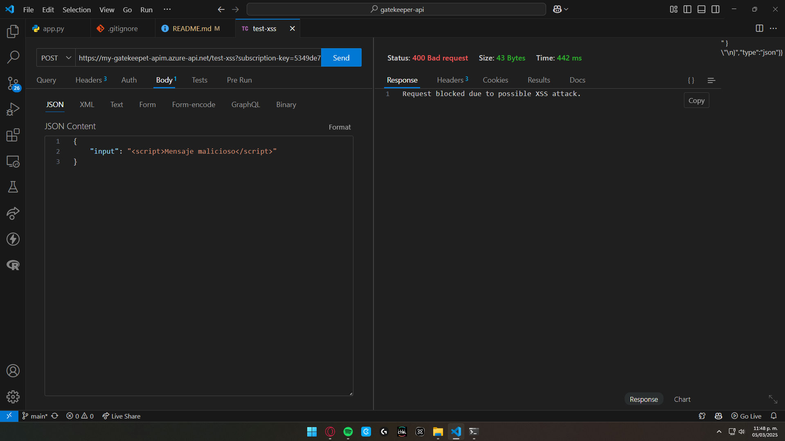

# Gatekeeper Pattern Azure

## By

- Yuluka Gigante Muriel

---

## Información general

Este repositorio contiene la implementación de una API sencilla para la demostración del funcionamiento del patrón de diseño Gatekeeper, usando Azure API Manager.

### Endpoints

La API contiene 3 endpoints básicos, hechos para ejemplificar el funcionamiento del patrón:

- GET: `/items/{item_id}`: retorna un mensaje indicando el id del item solicitado, y la información pasada en el parámetro `q`. La idea es mostrar cómo se rechaza el acceso cuando no se proporciona una API key válida, o los campos requeridos.

- GET: `/sensitive-data/`: retorna un mensaje indicando que el endpoint devolvería información sensible. La idea es mostrar cómo se rechaza el acceso cuando no se proporciona una API key válida.

- POST: `/test-xss`: retorna un mensaje con el cuerpo de la petición. La idea es mostrar cómo se rechaza el acceso cuando la request contiene un patrón identificado como malicioso (XSS).

---

## Implementación del patrón

Como mencioné anteriormente, la implementación del patrón se hizo por medio de Azure API Manager (APIM), que es una plataforma pensada para permitir la administración de APIs multinube. Esta plataforma permite definir reglas de manera muy sencilla:


También permite la implementación de reglas personalizadas por medio de etiquetas XML, tanto en la entrada de las solicitudes, como en la salida de las respuestas:


### Pasos

Los pasos a seguir para la implementación de APIM son:

1. Crear recurso

    Dentro de una cuenta de Azure:

    

    Ir a la creación de recursos y buscar "api", seleccionar `API Management`, y crear el recurso:

    

    

    **Nota:** la creación del APIM es bastante demorada y puede llegar a tardar hasta 1 hora.

2. Configurar API

    Una vez que la APIM está creada (**gatekeeper** o **guardian**), es necesario hacer la conexión con la API real (trusted host).

    Para esto, hay que dirigirse al recurso:

    

    En el panel izquierdo, ir a la sección `API` y luego a `HTTP`:

    
    
    Yo cr

    Una vez creada la API, ir a esta, y luego a la sección de `Settings`:

    

    En esta sección es donde se debe configurar la URL base de la API que se va a manejar. 
    
    Es importante marcar la opción `Subscription required`:
    
    

    Con esta, se indica que se debe tener una API key para acceder a los endpoints. Además, se configura el nombre que debe tener el parámetro, en caso de pasar la API key por medio de la URL, y el nombre que debe tener el header, en caso de pasársela por medio de los headers de la solicitud. En este caso, los nombres son `subscription-key` y `Ocp-Apim-Subscription-Key` respectivamente.

3. Crear endpoints

    Una vez se ha hecho la configuración general de la API que se va a administrar mediante el APIM, es preciso hacer la creación de los endpoints que serán accesibles por medio de este (que actúa como el **gatekeeper**). 

    Para esto, en la sección `Design` de la API:

    

    Y presionar en `Add operation`:

    

    Acá se puede hacer la configuración del endpoint que se quiere crear. Los endpoints deifnidos no tienen por qué ser exactamente iguales a los del **trusted host**. Esto significa que se pueden configurar para recibir información o campos extra que pueden ser útiles para el paso de la **_sanitización_**, por ejemplo.

    Debido a que la API de este ejemplo expone 3 endpoints para la demostración del funcionamiento del patrón, se han configurado estos:

    

    

    

4. Definir reglas de sanitización

    Los endpoints creados y configurados en el paso anterior serán accesibles por medio del APIM. Por ende, se deben crear las reglas que usará este para decidir si admitir, o no, una petición.

    De hecho, ya hay una **regla general definida**, que es la de la **API key**. Todos los llamados a los endpoints deben incluir la API key válida. Por cierto, para generar una API key es necesario ir, en el panel izquierdo, a la opción `Suscripciones`:

    

    Aquí, habrán un par de API keys default que se pueden usar. Para esto, hay que vincularlas con la API creada, haciendo clic sobre una de ellas, y realizando la configuración así:

    

    Ya que se ha configurado, se la puede copiar para poder usarla en los llamados.

    Otra regla ya definida es la de la estructura de `/items/{item_id}`, que espera el parámetro `q`, gracias a esta configuración:

    

    Un llamado a este endpoint que no incluya el parámetro mencionado, fallará por no seguir la estructura definida y esperada.

    Por último, se pueden definir reglas personalizadas usando **_XML_**. Para esto, hay que seleccionar el endpoint para el que se desean crear las reglas, e ir a la sección de `Inbound processing`:

    

    En esta sección, el ícono a la derecha de `Policies` es el que permite modificar las reglas de XML:

    

    Este panel permite definir las acciones que se deben hacer en caso de que las validaciones salgan bien, así como en caso de que no. Además, permite hacer validaciones sobre las entradas (**_requests_**), así como sobre las salidas (**_responses_**).

    En este caso, la regla que se está usando es para encontrar posibles mensajes que busquen realizar XSS:

    ```xml
    <set-variable name="requestBody" value="@((string)context.Request.Body.As<string>())" />
    <choose>
        <when condition="@(((string)context.Variables.GetValueOrDefault<string>("requestBody", "")).Contains(&quot;<script>&quot;))">
            <return-response>
                <set-status code="400" reason="Bad request" />
                <set-body>Request blocked due to possible XSS attack.</set-body>
            </return-response>
        </when>
        <otherwise>
            <set-body>@((string)context.Variables["requestBody"])</set-body>
        </otherwise>
    </choose>
    ```

5. Probar funcionamiento 

    Dado que todo está listo, es hora de pasar a probar que todo esté funcionando como es debido.

    - `/sensitive-data/`

        
        _Funcionando bien_

        
        _Funcionando mal por API key incorrecto_

    - `/items/{item-id}`

        
        _Funcionando bien_

        
        _Funcionando mal por estructura incorrecta_

    - `/xss-tes`

        
        _Funcionando bien_

        
        _Funcionando mal por posible XSS_